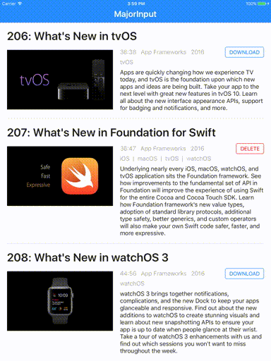

# Major Input

a novel iPad UI for quickly reading WWDC session transcripts while retaining video/presentation context

       

## Getting Started

Build it yourself, run on your iPad. UX is not designed for the iPad Simulator.

1. *Get the code*: Clone the repo, or download a zip, depending on how you want to get future updates.
1. *Install dependencies*: Run `cd <$SRCROOT>/Vendor; carthage bootstrap --no-build --no-use-binaries`, replacing `<$SRCROOT>` with your repo/download path.
1. *Configure code signing*: Select the MajorInput project in the Project Navigator. For both Targets, MajorInput and MajorInputTests, select your own Development Team in the General tab Signing section.
1. *Build and run*: Build the MajorInput scheme to your iPad as usual.

## Getting Help

Building to your iPad with your Apple Developer account is your responsibility. Please be aware that I cannot help with code signing issues.

For all other issues, please open a pull request or file a bug with as much information as possible, which should be much easier than usual since you'll be able to debug the app.

## License

I've shared the code first and foremost in order for you to be able to build and run it. The code is provided under an MIT license with one additional condition. You may not submit this app or substantial portions of it to any of Apple's App Stores.

## Usage

Select a session, wait for the video to download if it hasn't already, and consume it. The blue transformer to the right of the text marks the sync point between the transcript text and the video time, as does the small blue triangle in the filmstrip.

#### Session selection:

* Tap a session or its `DOWNLOAD` button to download the session.
* Tap `CANCEL` during a download to cancel the download.
* Tap `DELETE` to remove the downloaded video from the filesystem.
* Tap a session with a downloaded video to consume the session.

#### Session consumption:

* Drag either the transformer, the transcript, or the filmstrip to scrub the video.
* Tap a caption in the transcript to scroll that caption to the transformer.
* After dragging the transformer, you'll see a blue line indicating the transformer's anchor point. Tap the transformer to scroll it and the transcript back to the anchor point.
* Tap-and-drag the transformer to move its anchor point.
* Double tap the transformer to play/pause the video.
* Tap the video to show the linear video scrubber and back button.

#### Putting it all together

* Look at the filmstrip to quickly spot the video frame that provide the best context for the transcript lines you're about to read.
* Use the transformer to scrub the video to that frame, then read the transcript.
* Tap the transformer to scroll things back to the anchor point (assuming it's still near the top).
* Wash, rinse, repeat.

## Why?

Every developer needs a side project for learning new things and keeping active. This is mine.

Every year, the new shiny glistens, but enthusiasm fades as quickly as it came. Who has the time to watch that much video? I watch a few sessions at/during/after WWDC week, and I quickly reach a point where I think, "I'll sit down and watch a session", then I just cannot do it. Maybe I don't have an immediate need to know the things in a particular session. Maybe I spent all the time I had figuring out what order to watch, or what topic I want to watch. Maybe I feel like I already know the material and can't stomach the thought of spending all that time to catch one or two new nuggets.

Reading a session transcript is still passive learning, but, at least for me, it is just that critical bit more active than being trapped in completely passive linear video time that engages my brain. Not only do I cover the material faster, I absorb the material better. Doing and playing, active learning, remains better than passive learning. Documentation and source documentation are arguably a better source of information than sessions. But sessions still represent a critical bridge from the introduction of new stuff to getting hands-on and deep.

I expected this tool would make the huge (and growing yearly) corpus of sessions more accessible to me, so I built this first for myself, to find out. It saves me some time and keeps me engaged, and I think some of you will find it as useful as I do.

## What if you just watched session videos instead of making a tool to make it go faster?

Good question!

Let's amortize the cost of consuming all of each year's sessions over the course of the year. Let's call it 120 sessions in a year, 45 minutes each, or 5400 minutes. 5400 minutes/weekly is about 100 minutes a week. If we estimate this app shaves 25% off linear video time, we'll stretch that to almost a 30 minutes/week savings, giving me a 5 day budget to spend on this project.

[Why, indeed](http://wiki.c2.com/?PurposeOfProgramming).

## Contributing / Roadmap

Replicating functionality of the official WWDC app is a non-priority of this project. Use the official app if you want the functionality it provides.

That said, I want to continue improving this app. Please file bugs and create/vote on feature requests in Issues. Please consult with me before spending time on feature-level work.

I see two major axes for growth–platforms and content–but there are some technical considerations and financial constraints.

#### Platforms

For several reasons this project was an iPad app first, but there's room to expand to other platforms:

* Apple TV apps didn't always exist. Maybe there's a way this concept translates, but design is needed.
* iPhones weren't always so big. The concept makes less sense to me the smaller the screen gets, but maybe this can work on a plus phone.
* I am not efficient as a Mac developer. The concept begs to be translated to the Mac but requires some minor shifts in design. There is already a very nice [Mac WWDC app](https://github.com/insidegui/WWDC), and my first choice is to explore integration opportunities there.
* I am not efficient as an Android developer. The concept translates directly to Android tablets.
* I am not a web developer. The concept translates directly to the web, but technical constraints must be considered and raise the level-of-difficulty for such an effort (see below).

#### Content

The iOS developer community is absolutely **amazing**. Presentations from community conferences, meetups, and user groups can rival and even best the content quality of WWDC sessions. I think it would be great to see broader community presentations in this UI. And it doesn't need to stop at the iOS community, which is a small part of a much larger developer community. There's such a wealth of presentations available that I'd love to consume with this UI.

_If you and/or your organization or conference has content you would like to see in the app, please get in touch with me_.

#### Technical Constraints

Development of this app was made feasible by a few requisite factors, which put together appear to be unique to WWDC sessions.

* Content metadata, describing and pointing at remote assets, is *relatively* available and stable *enough* to build around.
* Video content is captioned. This is a **huge** service provided to us by Apple. Captions provide the timing information that makes it possible to map back and forth between video and transcript text.
* Video content is downloadable, not just streamable. Mostly this supports fast and smooth video scrubbing.

You can see that just about all of the other presentations now available are either not captioned or not downloadable. These are significant hurdles.

* Captioning is not free and also requires cooperation and coordination with video content owners.
* Generally, online video content hosts make it difficult/impractical to download content, though some may leave that option to the content owner.
* Applying the UI concept to streaming video is possible, of course. But the quality of the resulting UX is uncertain and definitely proportional to network bandwidth.
* There may also be a need for additional development for content host-specific video players, which may be more or less feasible.

#### Accessibility

While I consider this UI to be an attempt to increase lowercase accessibility, real Accessibility has not been considered beyond what's there from UIKit out of the box. I imagine the official WWDC app addresses accessibility well, and replicating its functionality is a non-priority. But if you have feedback about how this app can be made more accessible, or accessible in some novel way, please let me know.
